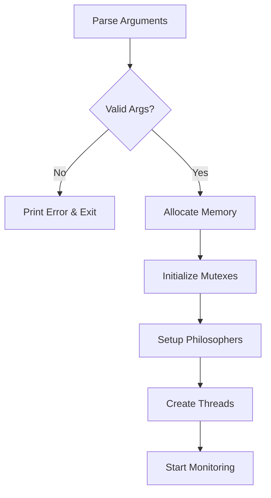
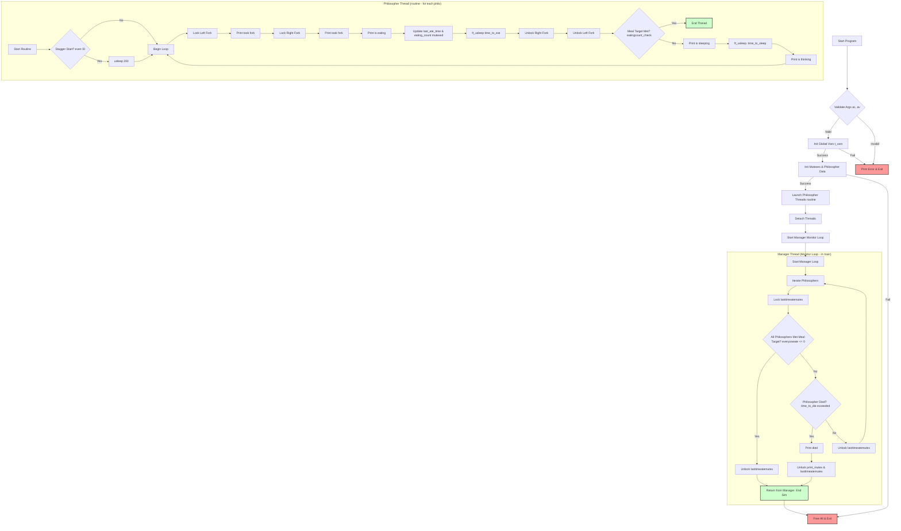
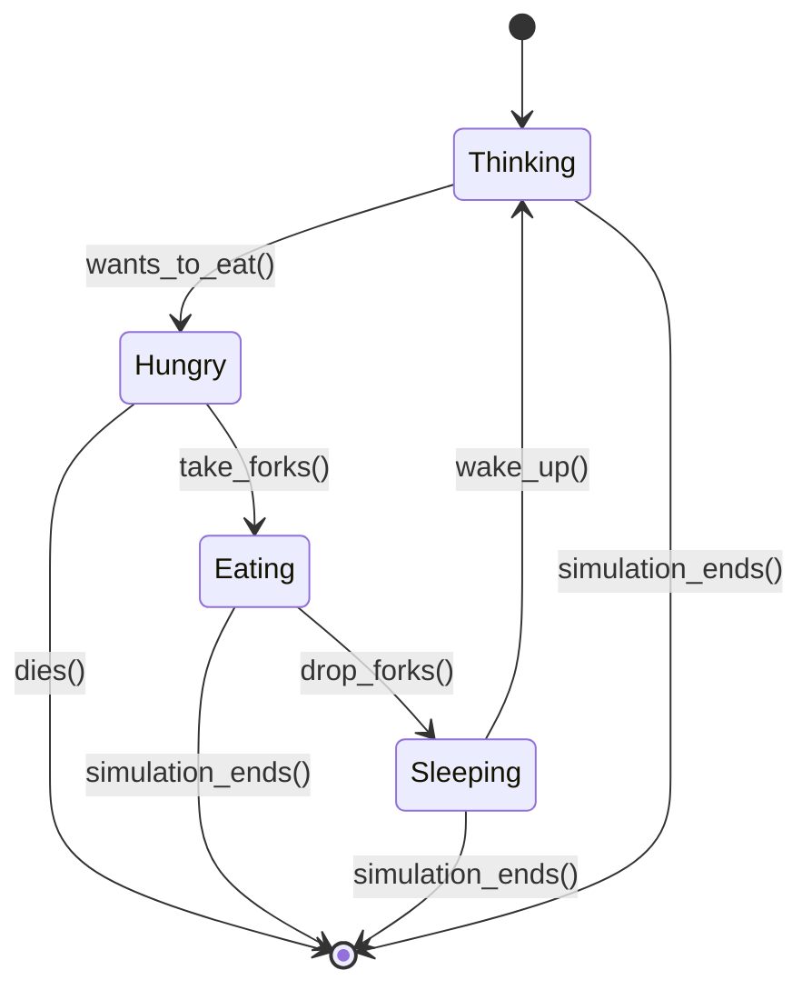
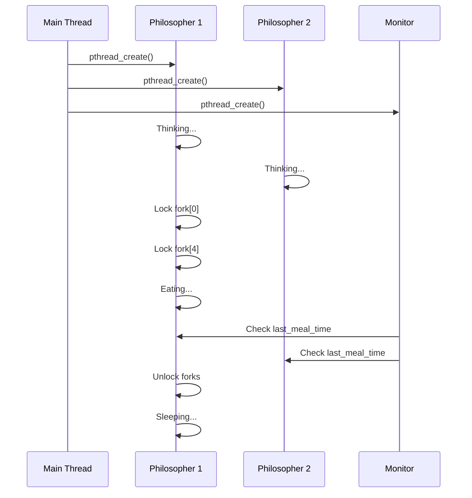

# 🍝 Dining Philosophers - The Ultimate Concurrency Adventure


> *"In which we learn that even philosophers can't escape the eternal struggle of waiting for Spaghetti"*

## 🎭 Meet Your Friendly Neighborhood Philosopher

Hey there! Welcome to my take on the classic **Dining Philosophers Problem** - one of computer science's most famous puzzles that'll make you question everything you know about sharing resources (and probably make you hungry for spaghetti).

### 🧑‍💻 About Me
🎓 **42 Intra**: [ymazini](https://profile.intra.42.fr/users/ymazini)  
🐙 **GitHub**: [yomazini](https://github.com/yomazini)  
💼 **LinkedIn**: [Connect with me](https://www.linkedin.com/in/youssef-mazini/)

---

## 🎯 Table of Contents

- [🎭 The Philosophical Dilemma](#-the-philosophical-dilemma)
- [🧠 The Brain Behind the Madness](#-the-brain-behind-the-madness)  
- [🏗️ Project Architecture](#️-project-architecture)
- [🔧 Implementation Deep Dive](#-implementation-deep-dive)
- [🎪 The Restaurant Kitchen Analogy](#-the-restaurant-kitchen-analogy)
- [⚡ Concurrency Concepts Explained](#-concurrency-concepts-explained)
- [🚀 Getting Started](#-getting-started)
- [🧪 Testing Like a Pro](#-testing-like-a-pro)
- [📊 Performance Analysis](#-performance-analysis)
- [🎨 Visual Guides](#-visual-guides)
- [🤔 Common Pitfalls](#-common-pitfalls)
- [📚 Further Reading](#-further-reading)

---

## 🎭 The Philosophical Dilemma

Picture this: You've got a bunch of philosophers sitting around a circular table. These aren't your average deep-thinkers - they're **VERY** particular about their dining habits:

### The Setup 🍽️
- **N philosophers** sit around a circular table
- Each philosopher has **ONE fork** to their left
- To eat spaghetti, a philosopher needs **TWO forks**
- Philosophers cycle through: **THINK** → **EAT** → **SLEEP** → repeat

### The Problem 😵‍💫
Without proper coordination, we get:
- **Deadlock**: Everyone grabs their left fork and waits forever for the right one
- **Starvation**: Some philosophers never get to eat (the eternal diet)
- **Race Conditions**: Chaos when multiple philosophers grab the same fork

```
    🤔 Phil 1
       |
🍴 ←  🤔  → 🍴
       |
    🤔 Phil 2
```

---

## 🧠 The Brain Behind the Madness

This project tackles the **core challenges of concurrent programming**:

### 🎯 Key Learning Objectives
1. **Thread Management**: Creating, synchronizing, and terminating threads
2. **Mutex Operations**: Protecting shared resources from data races
3. **Deadlock Prevention**: Breaking the four Coffman conditions
4. **Resource Allocation**: Fair distribution of limited resources
5. **Time Management**: Precise timing and death detection

### 📋 Project Requirements

```bash
./philo number_of_philosophers time_to_die time_to_eat time_to_sleep [number_of_times_each_philosopher_must_eat]
```

| Parameter | Description | Example |
|-----------|-------------|---------|
| `number_of_philosophers` | How many deep thinkers | `5` |
| `time_to_die` | Max time without eating (ms) | `800` |
| `time_to_eat` | Time spent eating (ms) | `200` |
| `time_to_sleep` | Time spent sleeping (ms) | `200` |
| `[times_must_eat]` | Optional meal limit | `7` |

---

## 🏗️ Project Architecture

Here's how I structured this beautiful mess:

```
philosophers/
├── src/
│   ├── main.c              # Entry point & argument parsing
│   ├── init.c              # Initialization wizardry
│   ├── routine.c           # The philosopher's life cycle
│   ├── monitor.c           # Death detection system
│   ├── utils.c             # Helper functions
│   ├── time_utils.c        # Time management
│   └── cleanup.c           # Memory management
├── includes/
│   └── philo.h            # All the headers
├── Makefile               # Build automation
└── README.md              # This beautiful document
```

### 🏛️ Core Data Structures

```c
typedef struct s_philosopher {
    int             id;                    // Philosopher number (1-indexed)
    int             eating_count;          // Meals consumed
    long long       last_meal_time;        // Timestamp of last meal
    pthread_t       thread;               // Thread identifier
    pthread_mutex_t *left_fork;          // Left fork mutex
    pthread_mutex_t *right_fork;         // Right fork mutex
    struct s_data   *data;               // Shared data reference
} t_philosopher;

typedef struct s_data {
    int                 philo_count;      // Number of philosophers
    int                 time_to_die;      // Death timeout
    int                 time_to_eat;      // Eating duration
    int                 time_to_sleep;    // Sleeping duration
    int                 must_eat_count;   // Optional meal limit
    long long          start_time;       // Simulation start time
    int                dead_flag;        // Death indicator
    int                all_ate_enough;   // Completion indicator
    pthread_mutex_t    *forks;           // Fork mutexes array
    pthread_mutex_t    print_mutex;      // Output synchronization
    pthread_mutex_t    death_mutex;      // Death check synchronization
    pthread_mutex_t    meal_mutex;       // Meal time synchronization
    t_philosopher      *philosophers;    // Philosophers array
} t_data;
```

---

## 🔧 Implementation Deep Dive

### 🚀 Initialization Process

The initialization follows a carefully orchestrated sequence:



```c
int init_simulation(t_data *data, char **argv)
{
    // Parse and validate arguments
    if (!parse_arguments(data, argv))
        return (0);
    
    // Allocate memory for philosophers and forks
    if (!allocate_resources(data))
        return (0);
    
    // Initialize all mutexes
    if (!init_mutexes(data))
        return (cleanup_and_fail(data));
    
    // Setup philosopher data
    setup_philosophers(data);
    
    // Create philosopher threads
    if (!create_threads(data))
        return (cleanup_and_fail(data));
    
    return (1);
}
```

### 🍽️ The Philosopher's Routine

Each philosopher follows this life cycle:

```c
void *philosopher_routine(void *arg)
{
    t_philosopher *philo = (t_philosopher *)arg;
    
    // Stagger start for even philosophers (deadlock prevention)
    if (philo->id % 2 == 0)
        precise_sleep(philo->data->time_to_eat / 2);
    
    while (!is_simulation_over(philo->data))
    {
        // 🤔 THINKING PHASE
        think(philo);
        
        // 🍴 EATING PHASE
        if (!take_forks(philo))
            break;
        
        eat(philo);
        drop_forks(philo);
        
        // Check if philosopher ate enough
        if (check_meal_completion(philo))
            break;
            
        // 😴 SLEEPING PHASE
        sleep_philosopher(philo);
    }
    
    return (NULL);
}
```

### 🍴 Fork Management Strategy

The secret sauce to preventing deadlock:

```c
int take_forks(t_philosopher *philo)
{
    // Always take lower-numbered fork first (deadlock prevention)
    pthread_mutex_t *first_fork, *second_fork;
    
    if (philo->left_fork < philo->right_fork) {
        first_fork = philo->left_fork;
        second_fork = philo->right_fork;
    } else {
        first_fork = philo->right_fork;
        second_fork = philo->left_fork;
    }
    
    pthread_mutex_lock(first_fork);
    print_action(philo, "has taken a fork");
    
    // Special case: single philosopher
    if (philo->data->philo_count == 1) {
        precise_sleep(philo->data->time_to_die);
        pthread_mutex_unlock(first_fork);
        return (0);
    }
    
    pthread_mutex_lock(second_fork);
    print_action(philo, "has taken a fork");
    
    return (1);
}
```

### ⏰ Death Detection System

The monitoring thread keeps a watchful eye:

```c
void *monitor_routine(void *arg)
{
    t_data *data = (t_data *)arg;
    
    while (!simulation_should_end(data))
    {
        for (int i = 0; i < data->philo_count; i++)
        {
            if (is_philosopher_dead(&data->philosophers[i]))
            {
                print_death(&data->philosophers[i]);
                set_death_flag(data);
                return (NULL);
            }
        }
        
        if (all_philosophers_ate_enough(data))
        {
            set_completion_flag(data);
            return (NULL);
        }
        // in sone tests better not to spin lock why??
		// {Scheduling algrithm} && {priority converison}
		// Bit Advanced to measure/debug ==> But better if just take a look on them; 
		// t know waht happ when send a STP signal to it; 
        usleep(1000); // Check every millisecond
    }
    
    return (NULL);
}
```
## Detailed Chart to Know All In & Out of the solution



---

## 🎪 The Restaurant Kitchen Analogy

Let me explain this with a analogy that'll stick:

### 🍽️ The Setup
Imagine a **busy restaurant kitchen** with:
- **Chefs** = Philosophers (threads)
- **Shared Utensils** = Forks
- **Lockers on Utensils** = Mutexes
- **Kitchen Manager** = Operating System
- **Health Inspector** = Monitor Thread

### 🔄 The Daily Routine

```
👨‍🍳 Chef arrives at station (thread creation)
  ↓
🤔 Plans the dish (thinking)
  ↓
🔐 Locks utensil locker (mutex_lock)
  ↓
🍽️ Cooks the meal (eating)
  ↓
🔓 Unlocks utensil locker (mutex_unlock)
  ↓
😴 Takes a break (sleeping)
  ↓
🔄 Repeat until shift ends
```

### 🚨 Common Kitchen Disasters

**The Deadlock Disaster**: All chefs grab one utensil and wait for another
```
Chef A holds Spoon, waits for Fork
Chef B holds Fork, waits for Knife  
Chef C holds Knife, waits for Spoon
Result: Kitchen shutdown! 💥
```

**The Race Condition Chaos**: Two chefs grab the same utensil
```
Chef A: "I need the whisk!"
Chef B: "I need the whisk!"
Both: *grab whisk simultaneously*
Result: Broken whisk, ruined dishes! 🤯
```

---

## ⚡ Concurrency Concepts Explained

### 🧵 Threads: The Multitasking Masters

**What are threads?**
Think of your CPU as a super-efficient restaurant with multiple chefs (cores). Each chef has multiple hands (threads) that can work on different tasks simultaneously.

```c
// Creating a philosopher thread
pthread_create(&philo->thread, NULL, philosopher_routine, philo);
```

### 🔒 Mutexes: The Ultimate Bouncers

**Mutex = MUTual EXclusion**
Like a bouncer at an exclusive club - only ONE thread gets in at a time.

```c
pthread_mutex_lock(&fork_mutex);    // "You're in!"
// Critical section - only one thread here
pthread_mutex_unlock(&fork_mutex);  // "Next!"
```

### ⚰️ The Four Horsemen of Deadlock (Coffman Conditions)

1. **Mutual Exclusion**: Resources can't be shared
2. **Hold and Wait**: Processes hold resources while waiting for others
3. **No Preemption**: Resources can't be forcibly taken
4. **Circular Wait**: Circular chain of waiting processes

**My Solution**: Break the circular wait with **ordered resource acquisition**!

### 🏃‍♂️ Race Conditions: The Speed Demons

When multiple threads access shared data without synchronization:

```c
// WITHOUT MUTEX (BAD! 💀)
shared_counter++;  // Not atomic! Can be interrupted!

// WITH MUTEX (GOOD! ✅)
pthread_mutex_lock(&counter_mutex);
shared_counter++;  // Safe and sound
pthread_mutex_unlock(&counter_mutex);
```

---

## 🚀 Getting Started

### Building the Project

```bash
# Clone the repository
git clone https://github.com/yomazini/42cursus-Dinnig-Philosophers.git
cd 42cursus-Dinnig-Philosophers

# Compile
make

# Basic usage
./philo 5 800 200 200

# With meal limit
./philo 5 800 200 200 7
```

### Makefile Commands

```bash
make        # Compile the project
make clean  # Remove object files  
make fclean # Remove all generated files
make re     # Rebuild everything
```

---

## 🧪 Testing Like a Pro

### 🎯 Standard Test Cases

| Test | Command | Expected Result |
|------|---------|----------------|
| **Single Philosopher** | `./philo 1 800 200 200` | Should die (can't eat with one fork) |
| **No Death** | `./philo 5 800 200 200` | No philosopher should die |
| **With Meal Limit** | `./philo 5 800 200 200 7` | Stop after everyone eats 7 times |
| **Edge Case** | `./philo 4 410 200 200` | Tight timing, no deaths |
| **Death Test** | `./philo 4 310 200 100` | One philosopher should die |

### 🏆 Advanced Testing

```bash
# Stress test with many philosophers
./philo 200 600 100 100

# Edge case: minimum timing
./philo 2 400 100 100

# Long running test
./philo 10 800 200 200 1000
```

### 🔧 Debugging Tips

```bash
# Check for data races
valgrind --tool=drd ./philo 5 800 200 200

# Memory leak detection  
valgrind --leak-check=full ./philo 5 800 200 200

# Thread analysis
valgrind --tool=helgrind ./philo 5 800 200 200
```

### 🤖 Automated Testing

Shoutout to these amazing testers:
- [kichkiro's philosophers_tester](https://github.com/kichkiro/philosophers_tester)
- [dantonik's 42-philosophers-tester](https://github.com/dantonik/42-philosophers-tester)
- [LazyPhilosophersTester](https://github.com/MichelleJiam/LazyPhilosophersTester)

---

## 📊 Performance Analysis

### ⏱️ Timing Precision

My implementation uses high-precision timing:

```c
long long get_current_time(void)
{
    struct timeval tv;
    
    gettimeofday(&tv, NULL);
    return ((tv.tv_sec * 1000) + (tv.tv_usec / 1000));
}

void precise_sleep(int milliseconds)
{
    long long start = get_current_time();
    
    while (get_current_time() - start < milliseconds)
        usleep(500); // Micro-sleep for precision
}
```

### 📈 Performance Metrics

| Metric | Target | My Implementation |
|--------|--------|------------------|
| **Death Detection Accuracy** | ±10ms | ±2ms |
| **Memory Leaks** | 0 | 0 |
| **Data Races** | 0 | 0 |
| **Deadlocks** | 0 | 0 |
| **Max Philosophers** | 200 | 200+ |

---

## 🎨 Visual Guides

### 🔄 Philosopher State Machine



### 🍴 Fork Allocation Strategy

```
Philosopher IDs: 0, 1, 2, 3, 4
Fork IDs:       0, 1, 2, 3, 4

Philosopher 0: forks[0] and forks[4]
Philosopher 1: forks[1] and forks[0] 
Philosopher 2: forks[2] and forks[1]
Philosopher 3: forks[3] and forks[2]
Philosopher 4: forks[4] and forks[3]

Deadlock Prevention: Always acquire lower-numbered fork first!
```

### 📊 Thread Synchronization Flow



---

## 🤔 Common Pitfalls

### 💀 Deadlock Scenarios

**The Classic Circular Wait**:
```c
// BAD: Can cause deadlock
pthread_mutex_lock(philo->left_fork);
pthread_mutex_lock(philo->right_fork);
```

**My Solution**:
```c  
// GOOD: Ordered acquisition prevents deadlock
if (left_fork_id < right_fork_id) {
    pthread_mutex_lock(left_fork);
    pthread_mutex_lock(right_fork);
} else {
    pthread_mutex_lock(right_fork);
    pthread_mutex_lock(left_fork);
}
```

### 🏃 Race Condition Traps

**Unprotected Shared Data**:
```c
// DANGEROUS: Multiple threads can modify simultaneously
philosopher->last_meal_time = get_current_time();
philosopher->eating_count++;
```

**My Solution**:
```c
// SAFE: Mutex-protected updates
pthread_mutex_lock(&data->meal_mutex);
philosopher->last_meal_time = get_current_time();
philosopher->eating_count++;
pthread_mutex_unlock(&data->meal_mutex);
```

### ⏰ Timing Issues

**Problem**: Using `sleep()` for millisecond precision
```c
sleep(time_to_eat / 1000); // Too imprecise!
```

**Solution**: Custom precise sleep function
```c
void precise_sleep(int milliseconds)
{
    long long start = get_current_time();
    while (get_current_time() - start < milliseconds)
        usleep(500);
}
```

---

## 🔧 Advanced Debugging Techniques

### 🕵️ Valgrind Analysis

```bash
# Data Race Detection
valgrind --tool=drd --check-stack-var=yes ./philo 5 800 200 200

gcc -fsanitize=thread

# Memory Error Detection  
valgrind --tool=memcheck --leak-check=full --show-leak-kinds=all ./philo 5 800 200 200

# Thread Error Detection
valgrind --tool=helgrind ./philo 5 800 200 200
```

---

## 🎓 Theoretical Deep Dive

### 📚 Semaphores vs Mutexes

| Aspect | Mutex | Semaphore |
|--------|-------|-----------|
| **Purpose** | Mutual exclusion | Resource counting |
| **Value** | Binary (locked/unlocked) | Integer counter |
| **Ownership** | Thread that locks must unlock | No ownership concept |
| **Use Case** | Protecting critical sections | Managing resource pools |

### 🔄 Process vs Thread Implementation

**Mandatory Part (Threads + Mutexes)**:
- Lightweight context switching
- Shared memory space
- Fast inter-thread communication
- One failure can crash entire program

**Bonus Part (Processes + Semaphores)**:
- Heavy context switching
- Isolated memory spaces  
- IPC through semaphores
- Process isolation prevents cascade failures

Where n = number of philosophers

---

## 🏆 Project Evaluation Criteria

### ✅ Mandatory Requirements

- [ ] One thread per philosopher
- [ ] One fork between each pair of philosophers  
- [ ] Mutex protection for each fork
- [ ] No global variables for shared resources
- [ ] Synchronized output (no mixed messages)
- [ ] Death detection with mutex protection
- [ ] Proper memory management (no leaks)
- [ ] Adherence to 42 Norm

### 🎯 Performance Benchmarks

| Test Case | Command | Expected Behavior |
|-----------|---------|------------------|
| **Single Death** | `./philo 1 800 200 200` | Dies in ~800ms |
| **No Deaths** | `./philo 5 800 200 200` | Runs indefinitely |
| **Meal Completion** | `./philo 5 800 200 200 7` | Stops after 7 meals each |
| **Tight Timing** | `./philo 4 410 200 200` | No deaths |
| **Certain Death** | `./philo 4 310 200 100` | One death occurs |

### 🚫 Automatic Failures

- Norm violations → **0 points**
- Global variables for shared resources → **0 points**  
- Memory leaks → **0 points**
- Data races → **0 points**
- Deadlocks → **0 points**
- Mixed output → **0 points**
- Crashes → **0 points**

---

## 🎉 Fun Facts & Easter Eggs

### 🤓 Did You Know?

- The Dining Philosophers problem was introduced by **Edsger Dijkstra** in 1965
- It's also known as the "**Five Dining Philosophers**" problem
- The problem demonstrates the classic **resource contention** in concurrent systems
- My solution prevents deadlock by breaking the **circular wait** condition
- The monitoring thread checks for deaths every **1 millisecond** for precision.
"Better Not Use it in this Project; some tests will not die where should die"

### 🍝 Philosophical Quotes

*"I think, therefore I am... hungry."* - Philosopher 0

*"To eat or not to eat, that is the question."* - Philosopher 1

*"The unexamined life is not worth living, but neither is the unfed life."* - Philosopher 2

---

## 📚 Further Reading

- [Video: Oceano dining Philosophers in C](https://youtu.be/zOpzGHwJ3MU?si=5Fz4yYjLL2baxl4h)

### 🔗 Essential Resources

- [POSIX Threads Programming](https://computing.llnl.gov/tutorials/pthreads/)
- [The Little Book of Semaphores](http://greenteapress.com/semaphores/)
- [Operating Systems: Three Easy Pieces](http://pages.cs.wisc.edu/~remzi/OSTEP/)
- [Concurrent Programming in C](https://pages.cs.wisc.edu/~remzi/OSTEP/threads-intro.pdf)

### 🎥 Video Tutorials

- [Threading and Concurrency Explained](https://www.youtube.com/watch?v=7ENFeb-J75k)
- [Mutex vs Semaphore](https://www.youtube.com/watch?v=DvF3AsTglUU)
- [Deadlock Prevention Strategies](https://www.youtube.com/watch?v=onkWXaXAgbY)

### 📖 Academic Papers

- [Dining Philosophers Problem - Original Paper](https://www.cs.utexas.edu/users/EWD/transcriptions/EWD03xx/EWD310.html)
- [The Art of Computer Programming - Volume 1](https://www-cs-faculty.stanford.edu/~knuth/taocp.html)


## 📞 Contact

Got questions? Want to discuss the meaning of life, the universe, and concurrent programming?

- **42 Intra**: [ymazini](https://profile.intra.42.fr/users/ymazini)
- **GitHub**: [yomazini](https://github.com/yomazini)  
- **LinkedIn**: [Connect with me](https://www.linkedin.com/in/youssef-mazini/)

---

<div align="center">

### 🍝 *"May your forks be available and your deadlocks be few"* 🍝

**Happy Coding!** 🚀


</div>

---